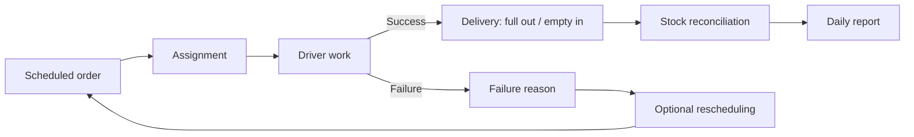
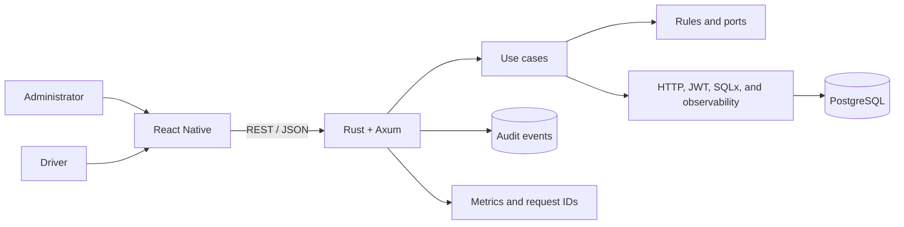

## Mobile operations for orders, deliveries, and stock

GasFlow is a logistics MVP for a local bottled-gas distributor. It connects a React Native application with a Rust/Axum backend and PostgreSQL to coordinate scheduled orders, assignments, deliveries, failures, rescheduling, and movements of full and empty cylinders.

The project focuses on operational control. It does not attempt to behave as an instant-delivery marketplace or introduce route optimization before solving basic traceability.

## The problem

In small and medium-sized operations, orders and deliveries are often coordinated through calls, messages, and handwritten notes. That fragmentation creates concrete problems:

- There is no consistent view of pending orders.
- Priorities and delivery windows are difficult to coordinate.
- Drivers do not have one authoritative list of assigned work.
- Full cylinders delivered and empty cylinders collected lose traceability.
- Failed deliveries are handled informally.
- The daily summary must be reconstructed manually.

GasFlow models those activities as a connected and auditable cycle.

## Users and context

### Administration

- Registers scheduled orders.
- Filters and reviews pending work.
- Assigns orders to drivers.
- Records incoming full-cylinder stock.
- Reviews stock and the daily report.

### Driver

- Signs in.
- Reviews assigned orders.
- Records a successful delivery.
- Enters full cylinders delivered and empty cylinders received.
- Records a failed delivery.
- Proposes rescheduling when appropriate.

The application uses a single mobile codebase with role-specific navigation to reduce maintenance and duplication.

## The solution

The MVP implements:

- Login and role resolution.
- Scheduled order creation.
- Filtering and pagination.
- Driver assignment.
- Assigned-order view.
- Successful delivery registration.
- Failure reason registration.
- Optional rescheduling.
- Incoming full-stock registration.
- Stock summary.
- Daily report.
- Audit trail for critical operations.
- Request IDs, metrics, and health checks.
- A foundation for local persistence and network-state awareness.

## Operational cycle

## Architecture

The backend remains a modular monolith with hexagonal boundaries that separate operational rules from HTTP, authentication, and persistence.

## Technical decisions

### One application for two roles

**Decision:** support administration and delivery through one application with role-specific navigation.

**Benefit:** reduces release duplication, dependencies, and maintenance.

**Cost:** requires clear authorization boundaries and prevents the client from relying on hidden screens as its only control.

### Scheduled delivery, not a marketplace

**Decision:** model a delivery date and time window.

**Benefit:** represents the real operation and supports work planning.

**Cost:** does not provide dynamic dispatch or real-time optimization.

### Quantitative stock

**Decision:** reconcile quantities of full and empty cylinders without serializing every asset.

**Benefit:** solves the primary control problem with less complexity.

**Cost:** does not provide an individual history for each cylinder.

### Rust and a modular monolith

**Decision:** use a strongly typed backend and a single deployment unit.

**Benefit:** explicit rules, shared transactions, and simpler operations.

**Cost:** compilation and structure are more demanding than a small API in a dynamic environment.

### Traceability from the MVP

**Decision:** include request IDs, structured logs, metrics, and auditing.

**Benefit:** makes it easier to investigate delivery and stock discrepancies.

**Cost:** adds persistence and observability work to the first version.

## Mobile UX

The application is organized around tasks rather than database tables.

### Administration

- Prioritizes pending orders and assignment.
- Supports filtering without exposing technical complexity.
- Separates stock management from delivery execution.

### Delivery

- Shows assigned work.
- Reduces delivery completion to concrete operational decisions.
- Requires explicit quantities and outcome.
- Supports failure registration and rescheduling.

The foundation includes AsyncStorage and NetInfo, but the offline queue and post-reconnection reconciliation still require broader validation.

## Security and operations

The implemented foundation includes:

- JWT.
- bcrypt hashing.
- Protected operational routes.
- Environment-variable configuration.
- Versioned migrations.
- Health and metrics endpoints.
- Structured tracing.
- Request IDs.
- Auditing.

A public deployment would require formal secret management, abuse controls, session and device policies, backup, and hosted monitoring.

## QA

The repository validates:

- `cargo fmt --check`.
- Backend tests against PostgreSQL.
- API and persistence integration.
- Mobile type checking.
- Jest.
- React Native Testing Library.
- Separate backend and mobile jobs in GitHub Actions.

Public evidence for real-device testing, a reconnection matrix, a load baseline, and an accessibility audit is still missing.

## Current state

| Capability | Status | Evidence summary |
|---|---|---|
| Login and roles | Implemented | API and role-based navigation |
| Scheduled orders | Implemented | Backend and administrative workflow |
| Assignment | Implemented | Endpoint and administration action |
| Assigned work | Implemented | Driver workflow |
| Successful delivery | Implemented | Full and empty quantities |
| Failed delivery | Implemented | Reason and optional rescheduling |
| Stock and daily report | Implemented | Endpoints and administrative screens |
| Auditing and request IDs | Implemented | Persistence and middleware |
| Network state and local persistence | Implemented | NetInfo and AsyncStorage |
| Offline queue and synchronization | Partial | Complete scenario matrix still missing |
| Production architecture | Partial | Local Docker stack; public target pending |
| Device testing | Partial | Documented evidence and matrix still missing |
| Route optimization | Pending | Outside the MVP |
| Serialized tracking | Pending | Current reconciliation is quantitative |
| Public Android build | Pending | No distributable artifact |
| Hosted demo | Pending | No public backend is linked |

## Trade-offs

### What it provides

- Connects mobile product, backend, and data around a real operation.
- Keeps the stock cycle linked to deliveries.
- Separates responsibilities by role.
- Includes traceability from the first version.
- Preserves a simple backend deployment.

### What it costs

- Offline resilience is not yet fully demonstrated.
- Quantitative stock limits individual asset traceability.
- Rust requires more investment for rapid changes than dynamic stacks.
- Without an Android build and public demo, the visual evidence remains incomplete.

## Lessons learned

- Modeling the correct process is more important than copying on-demand application patterns.
- Delivery and stock must be designed as one system.
- Sharing one application between roles lowers cost, but requires real backend authorization.
- Offline support is not solved by adding local storage alone; it needs conflict strategy and reconnection testing.
- Adding auditing early makes operational decisions easier to explain and review.

## Next steps

1. Capture administration and driver screens.
2. Record the order, assignment, delivery, and reconciliation cycle.
3. Expand offline and reconnection tests.
4. Verify configuration on an emulator and a physical device.
5. Generate a reproducible Android build.
6. Add a baseline for higher-volume lists.
7. Publish a controlled demonstration backend.
8. Create a stable portfolio release.

## Evidence

- [Repository](https://github.com/sjo1848/gasflow)
- PRD and backlog.
- Architecture and ADRs.
- Rust/Axum backend.
- React Native application.
- PostgreSQL migrations.
- CI workflow and tests.
