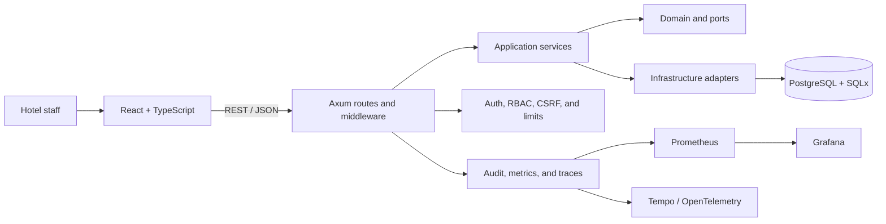

## A multi-hotel platform for coordinating operations, security, and control

HMS Elite is a reference full-stack implementation for hotel operations. The project connects rooms, guests, reservations, housekeeping, users, billing, reporting, and auditing within a multi-tenant SaaS architecture.

It was not designed as a CRUD demonstration. The technical goal was to model an operational domain with state transitions, capability-based permissions, data isolation between hotels, and verifiable quality controls.

## The problem

Hotel operations are distributed across front desk, housekeeping, administration, finance, and management. A useful system must maintain consistency between those teams and answer questions such as:

- Which room is available, occupied, or waiting for cleaning?
- Which user is allowed to perform a specific action?
- How is one hotel prevented from accessing another hotel’s data?
- How are reservations, charges, invoices, and cash closures connected?
- How are critical actions audited?
- How is an end-to-end journey validated instead of only an isolated endpoint?

The central challenge was to convert those processes into explicit modules, contracts, and rules without coupling the business domain to the web framework.

## Users and context

The system supports several operational profiles:

- SaaS or hotel-network administration.
- Hotel administration.
- Front desk.
- Housekeeping.
- Management and KPI review.
- Authorized financial operations.

Permissions are not resolved only through role names. The backend enforces specific capabilities and keeps the active hotel within the authorization context.

## The solution

The implemented scope includes:

- Authentication, token refresh, and logout.
- Hotel administration.
- Rooms, statuses, and availability.
- Guests and reservations.
- Housekeeping queue and state transitions.
- Users, roles, and capabilities.
- Audit trail and interface telemetry.
- Extra charges, billing, and cash closure.
- Occupancy and revenue reporting.
- Hotel-level and network-level indicators.

The product remains a modular monolith to preserve transactions and reduce operational complexity while the domain continues to evolve.

## Representative workflow

```text
Authenticated user
→ hotel, role, and capabilities
→ checks availability
→ creates or updates a reservation
→ changes the room’s operational status
→ housekeeping completes cleaning
→ charges and billing are recorded
→ the action is traced and feeds reporting
```

This journey summarizes several areas of the system. QA gates also execute core workflows across the backend and browser.

## Architecture



### Domain

Contains business concepts, policies, and contracts independent of Axum and SQLx.

### Application

Orchestrates use cases for rooms, reservations, guests, users, housekeeping, finance, reporting, and analytics.

### Infrastructure

Implements HTTP handlers, PostgreSQL repositories, authentication, middleware, and observability.

## Technical decisions

### Modular monolith before microservices

**Decision:** keep one deployable backend with clear internal boundaries.

**Benefit:** simple transactions, reproducible deployment, and less coordination between services.

**Cost:** the repository has a broad surface area and requires discipline to preserve module boundaries.

Extracting analytics or financial integrations would only make sense with operational evidence that justifies the additional cost.

### Capability-based authorization

**Decision:** use roles for assignment and capabilities for effective authorization.

**Benefit:** rules are more explicit and can be validated through permission matrices.

**Cost:** more contracts and tests must remain synchronized.

### Multi-tenant isolation as an invariant

**Decision:** propagate tenant context through authorization and persistence instead of treating it as a user-interface filter.

**Benefit:** reduces the risk of data leakage between hotels.

**Cost:** every sensitive repository and use case must consider hotel context.

### Governed OpenAPI contract

**Decision:** maintain a canonical versioned contract and alignment gates.

**Benefit:** reduces divergence between routes, documentation, and client code.

**Cost:** API changes require updating the contract, implementation, and evidence together.

### QA inside the architecture

**Decision:** turn security, integration, workflows, and performance into automated gates.

**Benefit:** relevant risks are detected before merge.

**Cost:** the pipeline is broader and needs its own maintenance.

## UX

The frontend is organized by feature and uses capability-based route protection.

The primary criteria are:

- Show actions according to actual permissions.
- Keep room and operational statuses understandable.
- Separate front-desk, housekeeping, administration, and finance workflows.
- Centralize HTTP and error handling.
- Avoid relying on the interface as the only security boundary.

The implementation exists, but a dedicated accessibility audit and validation with representative hotel users still need to be documented.

## Security

The implemented foundation includes:

- Password hashing.
- Access and refresh tokens.
- Capability-based authorization.
- Hotel-scoped access.
- Authentication and CSRF regression coverage.
- Configurable CORS.
- Security headers.
- Body-size limits.
- General and login-specific rate limiting.
- Request IDs and auditing.
- Environment configuration preflight.

This is an engineering foundation. It is not a certification, an independent penetration test, or evidence of legal compliance for a production deployment.

## QA and operations

The pipeline verifies:

- Secret scanning.
- Environment-profile security.
- OpenAPI and documentation alignment.
- Formatting and Clippy.
- Unit tests.
- SQLx integration.
- Tenant isolation.
- RBAC, authentication, and CSRF regressions.
- Frontend tests and production build.
- Playwright end-to-end journeys.
- Module-level coverage.
- Observability.
- Performance baseline.
- Historical CI stability.

Local operations include health, readiness, Prometheus, Grafana, Tempo, OpenTelemetry, backup, restore, and deployment with rollback.

## Current state

| Capability | Status | Evidence summary |
|---|---|---|
| Authentication and sessions | Implemented | Routes, middleware, and regressions |
| Hotels, rooms, and guests | Implemented | API, services, and persistence |
| Reservations | Implemented | Workflows and integration tests |
| Housekeeping | Implemented | Queue and operational transitions |
| Users, roles, and capabilities | Implemented | Administration and authorization matrix |
| Tenant isolation | Implemented | Scoped repositories and cross-tenant leakage tests |
| Billing and cash closure | Implemented | Use cases and persistence |
| Reporting and indicators | Implemented | Endpoints and evidence gates |
| Automated accessibility | Partial | Dedicated documented gate still missing |
| External runbook | Partial | Scripts exist; compact handoff guide is still missing |
| Public demo | Pending | No hosted environment is linked |
| Verified screenshots | Implemented | Reproducible Playwright dashboard evidence |
| Validation with real hotels | Pending | Outside the current evidence boundary |

## Trade-offs

### What it provides

- Strong separation between domain and infrastructure.
- Verifiable multi-tenant security.
- Workflow coverage beyond CRUD.
- Reproducible local environment.
- QA and operational evidence.

### What it costs

- More structure than a small application.
- A broad and slower pipeline.
- A larger configuration surface.
- Risk of overengineering if user validation is postponed indefinitely.

## Lessons learned

- Multi-tenant security must be designed as a cross-cutting property, not added at the end.
- Capability-based permissions are more precise, but they require governance between backend and frontend.
- A pipeline can become an internal product and needs clarity, diagnostics, and maintenance.
- Operational tooling does not replace UX and business-model validation.
- Keeping a modular monolith can be more mature than adopting microservices prematurely.

## Next steps

1. Capture additional SaaS administration, front-desk, housekeeping, and management views.
2. Record a short journey from reservation to checkout or operational closure.
3. Verify quick start from a clean clone.
4. Create a tagged portfolio release.
5. Publish a controlled read-only demo.
6. Add a dedicated accessibility audit.
7. Consolidate the threat model and operational runbook.
8. Validate workflows against realistic hotel scenarios.

## Evidence

- [Repository](https://github.com/sjo1848/hotel-management-system)
- Technical and professional README.
- Conservative implementation status.
- OpenAPI contract.
- Full-stack CI workflow.
- Security, QA, performance, and operations scripts.
