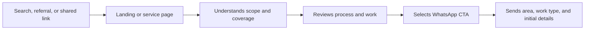
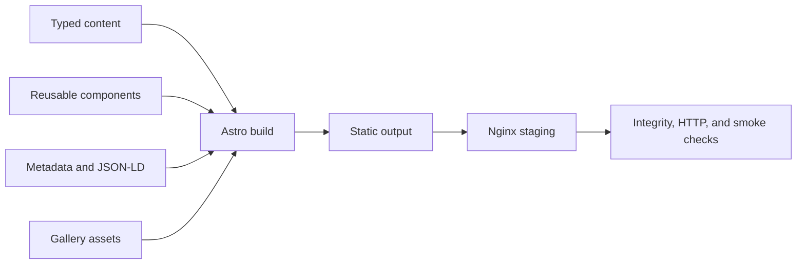

## A commercial website designed to turn inquiries into coordinated work

JM Soluciones Eléctricas is a landing page for electrical projects, expansions, renovations, and installations in Greater Mendoza. The product organizes the commercial proposal, explains the work process, and guides visitors toward a WhatsApp inquiry with enough context to begin an assessment.

The project does not turn a local service into an unnecessarily complex platform. It uses static architecture, typed content, and reproducible delivery controls to achieve commercial clarity, low operating cost, and a maintainable foundation.

## The problem

A potential customer who needs an electrical installation or repair often arrives with incomplete information:

- They do not know how to describe the work technically.
- They need to distinguish between an emergency, a repair, and planned work.
- They do not know the scope, service area, or process before receiving a quote.
- They look for visual evidence and trust signals.
- They want to resolve the inquiry from a phone without completing a long form.

For the business, answering inquiries without location, type of work, or initial evidence creates repetitive exchanges and makes opportunities harder to classify.

## Users and context

The primary journey is designed for people arriving from:

- Local search.
- Referrals.
- Social media.
- A directly shared link.

Interaction is expected to be primarily mobile. The website must help visitors understand services, coverage, and basic conditions before opening WhatsApp with a structured message.

## The solution

The product implements:

- Responsive, mobile-first landing page.
- Electrical service categories.
- Dedicated pages for electrical panels, emergencies, installations, and larger projects.
- Centralized and typed commercial content.
- Consistent generation of WhatsApp links and messages.
- Real-work gallery organized by type.
- Local SEO with metadata, canonical URLs, JSON-LD, sitemap, and robots.
- Coverage-area pages.
- Unit tests with Vitest.
- Static production build.
- Nginx staging through Docker Compose.
- Automated quality gate and release preflight.

## Conversion journey

The goal is not to automatically close a contract. It is to improve the quality of the first inquiry and reduce friction when coordinating an assessment and quote.

## Architecture

The static output reduces the operational surface. A dedicated backend is not required to serve content or collect personal data through forms.

## Technical decisions

### Static-first architecture

**Decision:** use Astro with static generation.

**Benefit:** strong performance, SEO, simple deployment, and a smaller failure surface.

**Cost:** future dynamic capabilities must be incorporated through external services or an explicit architecture extension.

### Typed commercial content

**Decision:** centralize identity, services, process, coverage, calls to action, and conditions in content modules.

**Benefit:** avoids contradictions between sections and makes the proposal easier to update without editing visual components.

**Cost:** requires discipline to avoid hardcoding commercial content back into the interface.

### WhatsApp as the conversion channel

**Decision:** build contextual messages based on the CTA origin and selected service.

**Benefit:** the user reaches the familiar channel with area, type of work, and initial details, reducing repetitive questions.

**Cost:** conversion depends on an external platform and must be verified across devices.

### Local SEO by intent and coverage

**Decision:** combine a general landing page with service and coverage pages, canonical URLs, JSON-LD, sitemap, and robots.

**Benefit:** each route answers a concrete intent while maintaining consistent technical signals.

**Cost:** uncontrolled expansion could create repetitive content, so every route must retain real differentiation and value.

### Gallery with automated validation

**Decision:** verify that declared assets exist and that the build does not publish broken references.

**Benefit:** visual evidence no longer depends only on manual review.

**Cost:** photographs require maintenance, optimization, and authorization checks before publication.

### Reproducible preflight

**Decision:** validate the product in a clean container, build it, serve it through Nginx, and run smoke tests against the actual output.

**Benefit:** release criteria include more than local compilation.

**Cost:** adds CI time and script maintenance, balanced by more predictable delivery.

## UX and content

The experience prioritizes:

- Understandable language without removing technical precision.
- Services grouped by customer need.
- Visible scope and conditions before contact.
- A clear assessment, quote, execution, and delivery process.
- Persistent calls to action and contextual WhatsApp messages.
- Visual evidence organized by work type.
- Comfortable mobile navigation and reading.

UX is evaluated as part of the commercial system: content clarity, inquiry quality, accessibility, and maintainability matter as much as appearance.

## SEO and public structure

The implementation includes:

- Configurable titles and descriptions.
- Canonical URLs.
- JSON-LD structured data.
- Generated sitemap.
- Robots file.
- Service routes.
- Local coverage pages.
- Output integrity validation.

The project does not claim search ranking, traffic volume, or conversion results. Those outcomes require a production domain, indexing, and measurement over time.

## QA and delivery

The quality gate executes:

- Reproducible installation through `npm ci`.
- Astro type checking.
- Unit tests with Vitest.
- Production build.
- `dist` integrity validation.
- Gallery asset verification.
- Nginx staging.
- HTTP smoke tests against the home page, robots, and sitemap.
- Preflight evidence logging.
- GitHub Actions CI.

The repository also provides Make and Docker Compose commands to align development, staging, and validation.

## Current state

| Capability | Status | Evidence summary |
|---|---|---|
| Responsive landing page | Implemented | Astro layouts and components |
| Services and dedicated routes | Implemented | Content and pages by intent |
| Centralized content | Implemented | Typed landing modules |
| WhatsApp conversion | Implemented | Generator and typed origins |
| Work gallery | Implemented | Organized assets and validation |
| Technical and local SEO | Implemented | Metadata, JSON-LD, sitemap, and robots |
| Unit tests | Implemented | Vitest coverage for critical utilities |
| Build and staging | Implemented | Docker Compose and Nginx |
| Release preflight | Implemented | Integrity and HTTP smoke scripts |
| CI quality gate | Implemented | GitHub Actions workflow |
| Verified public cover | Implemented | Privacy-safe CI visual artifact |
| Production domain | Pending | Final public URL must be confirmed |
| Final business contact data | Pending | Must be configured before release |
| Conversion metrics | Pending | Requires public operation and analytics |
| Final accessibility audit | Pending | Dedicated evidence is still missing |
| Production Core Web Vitals | Pending | Requires a deployed domain |

## Trade-offs

### What it provides

- Architecture proportional to a commercial website.
- Low runtime cost.
- Maintainable content and calls to action.
- Visual evidence integrated into the product.
- Executable local SEO.
- Reproducible release process.

### What it does not attempt to solve

- Automatic visit scheduling.
- CRM or opportunity tracking.
- Online payments.
- Automatic quotes without an assessment.
- Commercial metrics without public operation.

Those capabilities should only be added when there is evidence that they improve the real process.

## My contribution

My work includes:

- Definition of the commercial objective and primary journey.
- Service organization and content architecture.
- Mobile-first UX design and CTA hierarchy.
- Frontend implementation with Astro, TypeScript, and Tailwind CSS.
- Modeling WhatsApp messages and origins.
- Technical SEO and structured data.
- Tests, Docker, staging, and release automation.
- Operational documentation and roadmap.

## Next steps

1. Confirm the production domain, final contact details, and environment variables.
2. Run the strict preflight with final configuration.
3. Verify authorization and optimization for any published gallery photographs.
4. Complete accessibility and keyboard-navigation audits.
5. Expand reproducible desktop and mobile evidence.
6. Publish and measure performance, inquiries, and entry routes.
