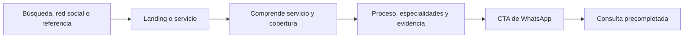
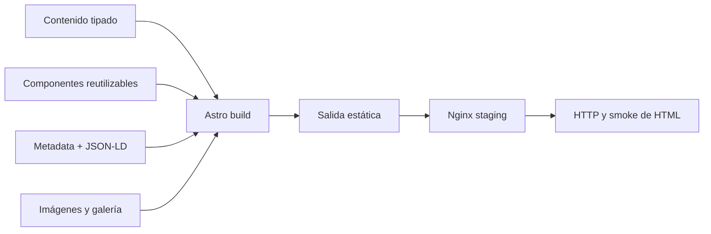

## Un sitio comercial simple, rápido y orientado al contacto

A-M-R Refrigeración es un sitio para una empresa local de servicios de refrigeración. El objetivo no fue construir una aplicación compleja, sino ayudar a una persona a entender qué servicios se ofrecen, evaluar confianza y realizar una consulta por WhatsApp con la menor fricción posible.

El repositorio demuestra que un sitio comercial también puede aplicar arquitectura de contenido, SEO técnico, UX mobile-first y controles de entrega reproducibles.

## El problema

Muchos servicios locales dependen de redes sociales, recomendaciones y mensajería. Sin un sitio claro, un potencial cliente puede no saber:

- Qué trabajos realiza el negocio.
- Qué tipos de equipos atiende.
- En qué zona opera.
- Qué evidencia de trabajo existe.
- Cómo contactar rápidamente.
- Si la información que encontró está actualizada.

La solución debía reducir esa incertidumbre sin crear cuentas, formularios extensos ni infraestructura innecesaria.

## Usuarios y contexto

El usuario principal llega desde:

- Búsqueda local.
- Redes sociales.
- Recomendación.
- Enlace compartido.

La mayor parte de la interacción esperada ocurre desde móvil. El recorrido termina en WhatsApp, donde el negocio ya atiende consultas.

## La solución

El sitio implementa:

- Experiencia responsive.
- Landing principal.
- Rutas orientadas a servicios.
- Contenido de negocio centralizado.
- CTAs y generación de URL para WhatsApp.
- Configuración opcional de Instagram.
- Metadatos por página.
- JSON-LD.
- Sitemap y robots.
- Galería con fallback y validación estricta.
- Build de producción.
- Staging Nginx en contenedor.
- Smoke tests HTTP y de HTML generado.
- Pipeline de CI.

## Recorrido de conversión

## Arquitectura

No existe un servidor de aplicación para el núcleo del sitio. El contenido se genera estáticamente y puede desplegarse en infraestructura simple.

## Decisiones técnicas

### Arquitectura static-first

**Decisión:** usar Astro y salida estática.

**Beneficio:** bajo costo operativo, buen rendimiento, SEO y superficie reducida de fallo.

**Costo:** funciones dinámicas futuras necesitarían servicios externos o una ampliación de arquitectura.

### Contenido centralizado

**Decisión:** mantener información del negocio en un módulo tipado.

**Beneficio:** reduce inconsistencias y facilita revisar cambios.

**Costo:** requiere disciplina para no volver a duplicar contenido dentro de componentes.

### WhatsApp como conversión

**Decisión:** dirigir la consulta al canal que el negocio ya utiliza.

**Beneficio:** menor fricción y ausencia de almacenamiento de datos personales en un formulario propio.

**Costo:** la conversión depende de una plataforma externa y necesita pruebas por dispositivo.

### SEO como salida ejecutable

**Decisión:** generar y validar metadata, JSON-LD, sitemap y robots.

**Beneficio:** SEO deja de ser solo una intención documental.

**Costo:** cambios de contenido o rutas deben conservar integridad del output.

### Fallback de imágenes con modo estricto

**Decisión:** permitir desarrollo sin todas las fotos, pero fallar preflight antes de release si faltan activos requeridos.

**Beneficio:** evita bloquear trabajo temprano y protege calidad final.

**Costo:** necesita dos modos claramente documentados y probados.

### Staging en contenedor

**Decisión:** servir `dist` mediante Nginx antes del release.

**Beneficio:** los smoke checks operan sobre los archivos generados que se desplegarían.

**Costo:** añade Docker a un proyecto que podría visualizarse con un servidor local más simple.

## UX y contenido

Las decisiones principales son:

- Priorizar lectura móvil.
- Explicar servicios sin lenguaje excesivamente técnico.
- Construir confianza antes del CTA.
- Mantener contacto visible.
- Evitar formularios y pasos innecesarios.
- Preferir imágenes reales con consentimiento.
- Separar páginas de servicio para entrada desde búsqueda.

El sitio no debe evaluarse únicamente por apariencia. La claridad del contenido, la calidad del CTA y la facilidad de mantenimiento forman parte del resultado.

## SEO

La implementación incluye:

- Metadata por página.
- Configuración canonical.
- JSON-LD.
- Sitemap.
- Robots.
- Rutas de servicio.
- Validación del output generado.

No se afirman posiciones en buscadores, tráfico o crecimiento. Esos resultados requieren dominio publicado, indexación, competencia y medición temporal.

## QA y entrega

El proceso valida:

- Astro y TypeScript.
- Build de producción.
- Integridad de `dist`.
- Estructura crítica del HTML.
- Sitemap y robots.
- Política de imágenes.
- Inicio de staging Nginx.
- Respuesta HTTP.
- Secciones renderizadas.
- Ejecución en GitHub Actions.

Esto evita que “compila” sea el único criterio de release.

## Estado real

| Capacidad | Estado | Evidencia resumida |
|---|---|---|
| Landing responsive | Implementado | Componentes y layouts Astro |
| Rutas de servicio | Implementado | Páginas enfocadas por contenido |
| Contenido centralizado | Implementado | Módulo tipado de negocio |
| Contacto por WhatsApp | Implementado | Utilidad y CTAs |
| Galería y fallback | Implementado | Assets y política de validación |
| Metadata y JSON-LD | Implementado | Utilidad SEO |
| Sitemap y robots | Implementado | Integración y archivos públicos |
| Build y staging | Implementado | Docker, Nginx y Makefile |
| Smoke tests de release | Implementado | Scripts de integridad y HTTP |
| URL de producción | Pendiente | No hay target verificado documentado |
| Métricas de conversión | Pendiente | No se incluyen datos reales |
| Auditoría de accesibilidad | Pendiente | Falta evidencia dedicada |
| Core Web Vitals productivos | Pendiente | Requiere dominio desplegado |
| Investigación formal con clientes | Pendiente | Fuera de la evidencia actual |

## Trade-offs

### Lo que aporta

- Arquitectura proporcional al objetivo.
- Bajo mantenimiento de runtime.
- Contenido y SEO revisables.
- Contacto directo.
- Release verificable.
- Evidencia de que QA también aplica a frontend comercial.

### Lo que cuesta

- Dependencia de WhatsApp para convertir.
- Sin CMS, los cambios requieren flujo de código.
- Sin producción verificada, no se pueden demostrar métricas reales.
- Docker agrega complejidad a cambio de reproducibilidad de staging.

## Aprendizajes

- Una solución profesional no necesita ser una aplicación compleja.
- La arquitectura debe responder al resultado comercial, no al deseo de usar más tecnología.
- SEO y contenido necesitan validación de output, no solo configuración.
- Permitir fallback durante desarrollo y exigir activos finales en release evita dos extremos: bloqueo y baja calidad.
- Las métricas deben incorporarse después del despliegue y sin inventar causalidad.

## Próximos pasos

1. Verificar dominio y canonical de producción.
2. Capturar vistas desktop y mobile.
3. Probar enlaces de WhatsApp en Android e iOS.
4. Ejecutar auditoría de accesibilidad.
5. Registrar Core Web Vitals productivos.
6. Añadir analítica respetuosa de privacidad si existe una decisión de medición.
7. Incorporar imágenes finales con consentimiento y texto alternativo.
8. Documentar resultados reales después de reunir datos suficientes.

## Evidencia

- [Repositorio](https://github.com/sjo1848/A-M-R-Refrigeracion)
- Frontend Astro y TypeScript.
- Contenido tipado.
- Utilidades de WhatsApp y SEO.
- Docker/Nginx staging.
- Scripts de preflight, integridad y smoke HTTP.
- Workflow de CI.
