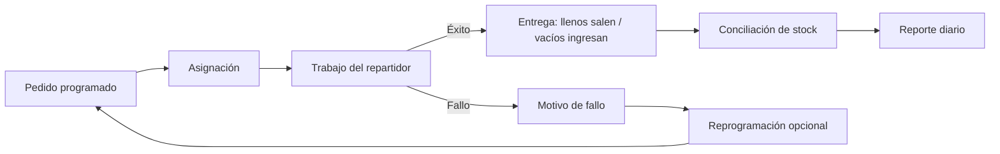
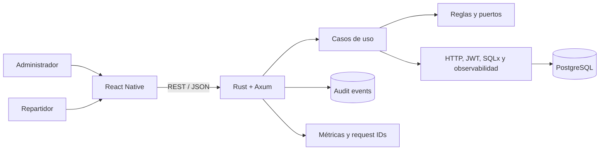

# GasFlow

## Operación móvil para pedidos, entregas y stock

GasFlow es un MVP de logística para una distribuidora local de garrafas. Conecta una aplicación React Native con un backend Rust/Axum y PostgreSQL para coordinar pedidos programados, asignaciones, entregas, fallos, reprogramaciones y movimientos de envases llenos y vacíos.

El proyecto se concentra en control operativo. No intenta comportarse como un marketplace de entrega inmediata ni introduce optimización de rutas antes de resolver la trazabilidad básica.

## El problema

En operaciones pequeñas o medianas, pedidos y entregas suelen coordinarse mediante llamadas, mensajes y anotaciones. Esa fragmentación genera problemas concretos:

- No existe una vista consistente de los pedidos pendientes.
- Las prioridades y ventanas de entrega son difíciles de coordinar.
- Los repartidores no tienen una lista única de trabajo asignado.
- Los envases llenos entregados y vacíos recibidos pierden trazabilidad.
- Las entregas fallidas se resuelven informalmente.
- El resumen diario requiere reconstrucción manual.

GasFlow modela esas actividades como un ciclo conectado y auditable.

## Usuarios y contexto

### Administración

- Registra pedidos programados.
- Filtra y revisa trabajo pendiente.
- Asigna pedidos a repartidores.
- Registra ingresos de stock lleno.
- Consulta stock y reporte diario.

### Repartidor

- Inicia sesión.
- Consulta pedidos asignados.
- Registra una entrega exitosa.
- Indica cantidades llenas entregadas y vacías recibidas.
- Registra una entrega fallida.
- Propone reprogramación cuando corresponde.

La aplicación utiliza una sola base móvil con navegación diferenciada por rol para reducir mantenimiento y duplicación.

## La solución

El MVP implementa:

- Login y resolución de rol.
- Creación programada de pedidos.
- Filtros y paginación.
- Asignación a repartidores.
- Vista de pedidos asignados.
- Registro de entrega exitosa.
- Registro de fallo y motivo.
- Reprogramación opcional.
- Ingreso de stock lleno.
- Resumen de stock.
- Reporte diario.
- Auditoría de operaciones críticas.
- Request IDs, métricas y salud.
- Base para persistencia local y conocimiento del estado de red.

## Ciclo operativo

## Arquitectura

El backend se mantiene como monolito modular con límites hexagonales para separar reglas operativas de HTTP, autenticación y persistencia.

## Decisiones técnicas

### Una aplicación para dos roles

**Decisión:** administrar y repartir desde una sola aplicación con navegación específica por rol.

**Beneficio:** reduce duplicación de releases, dependencias y mantenimiento.

**Costo:** exige mantener límites claros de autorización y evitar que el cliente dependa de ocultar pantallas como único control.

### Entrega programada, no marketplace

**Decisión:** modelar fecha y ventana de entrega.

**Beneficio:** representa la operación real y permite planificar trabajo.

**Costo:** no ofrece despacho dinámico ni optimización en tiempo real.

### Stock cuantitativo

**Decisión:** conciliar cantidades de envases llenos y vacíos, sin serializar cada activo.

**Beneficio:** resuelve el control principal con menor complejidad.

**Costo:** no permite historial individual por garrafa.

### Rust y monolito modular

**Decisión:** backend fuertemente tipado y un único despliegue.

**Beneficio:** reglas explícitas, transacciones compartidas y operación simple.

**Costo:** compilación y estructura más exigentes que una API pequeña en un entorno dinámico.

### Trazabilidad desde el MVP

**Decisión:** incluir request IDs, logs estructurados, métricas y auditoría.

**Beneficio:** facilita investigar diferencias de entregas y stock.

**Costo:** agrega persistencia y observabilidad a una primera versión.

## UX móvil

La aplicación se organiza alrededor de tareas, no de tablas de base de datos.

### Administración

- Prioriza pedidos pendientes y asignación.
- Permite filtrar sin exponer complejidad técnica.
- Separa stock de ejecución de entregas.

### Reparto

- Muestra el trabajo asignado.
- Reduce la entrega a decisiones operativas concretas.
- Exige cantidades y resultado explícito.
- Permite registrar fallo y reprogramación.

La base incorpora AsyncStorage y NetInfo, pero la cola offline y la reconciliación después de reconectar todavía necesitan validación más amplia.

## Seguridad y operación

La base implementada incluye:

- JWT.
- Hashing bcrypt.
- Rutas operativas protegidas.
- Configuración mediante variables de entorno.
- Migraciones versionadas.
- Health y metrics.
- Tracing estructurado.
- Request IDs.
- Auditoría.

Un despliegue público necesitaría gestión formal de secretos, controles de abuso, políticas de sesión/dispositivo, backup y monitoreo alojado.

## QA

El repositorio valida:

- `cargo fmt --check`.
- Tests backend contra PostgreSQL.
- Integración API y persistencia.
- Typecheck móvil.
- Jest.
- React Native Testing Library.
- Jobs separados de backend y mobile en GitHub Actions.

Todavía faltan evidencia pública de pruebas en dispositivos reales, matriz de reconexión, baseline de carga y auditoría de accesibilidad.

## Estado real

| Capacidad | Estado | Evidencia resumida |
|---|---|---|
| Login y roles | Implementado | API y navegación por rol |
| Pedidos programados | Implementado | Backend y flujo administrativo |
| Asignación | Implementado | Endpoint y acción de administración |
| Trabajo asignado | Implementado | Flujo del repartidor |
| Entrega exitosa | Implementado | Cantidades llenas y vacías |
| Entrega fallida | Implementado | Motivo y reprogramación opcional |
| Stock y reporte diario | Implementado | Endpoints y pantallas administrativas |
| Auditoría y request IDs | Implementado | Persistencia y middleware |
| Estado de red y persistencia local | Implementado | NetInfo y AsyncStorage |
| Cola offline y sincronización | Parcial | Falta matriz completa de escenarios |
| Arquitectura de producción | Parcial | Stack Docker local; target público pendiente |
| Testing en dispositivos | Parcial | Falta evidencia y matriz documentada |
| Optimización de rutas | Pendiente | Fuera del MVP |
| Tracking serializado | Pendiente | Conciliación actual por cantidades |
| Build Android público | Pendiente | No hay artefacto distribuible |
| Demo alojada | Pendiente | No hay backend público enlazado |

## Trade-offs

### Lo que aporta

- Conecta producto móvil, backend y datos alrededor de una operación real.
- Mantiene el ciclo de stock vinculado a las entregas.
- Diferencia responsabilidades por rol.
- Incluye trazabilidad desde la primera versión.
- Conserva un despliegue backend simple.

### Lo que cuesta

- La resiliencia offline todavía no está completamente demostrada.
- El stock cuantitativo limita trazabilidad individual.
- Rust exige una inversión mayor para cambios rápidos que stacks dinámicos.
- Sin build Android y demo pública, la evidencia visual es incompleta.

## Aprendizajes

- Modelar el proceso correcto es más importante que copiar patrones de aplicaciones on-demand.
- La entrega y el stock deben diseñarse como un mismo sistema.
- Compartir una app entre roles reduce costo, pero exige autorización real en backend.
- Offline no se resuelve únicamente instalando almacenamiento local: requiere estrategia de conflictos y pruebas de reconexión.
- Incluir auditoría temprano facilita explicar y revisar decisiones operativas.

## Próximos pasos

1. Capturar pantallas de administración y reparto.
2. Grabar el ciclo pedido, asignación, entrega y conciliación.
3. Ampliar pruebas de offline y reconexión.
4. Verificar configuración en emulador y dispositivo real.
5. Generar un build Android reproducible.
6. Agregar baseline para listas con mayor volumen.
7. Publicar backend controlado de demostración.
8. Crear release estable de portafolio.

## Evidencia

- [Repositorio](https://github.com/sjo1848/gasflow)
- PRD y backlog.
- Arquitectura y ADR.
- Backend Rust/Axum.
- Aplicación React Native.
- Migraciones PostgreSQL.
- Workflow de CI y tests.
