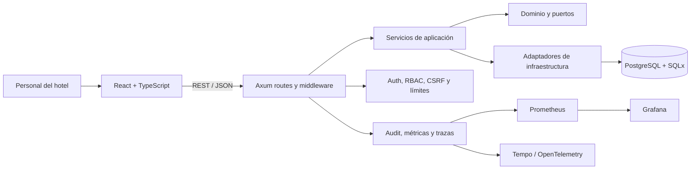

# HMS Elite

## Una plataforma multi-hotel para coordinar operaciones, seguridad y control

HMS Elite es una implementación full stack de referencia para operaciones hoteleras. El proyecto conecta habitaciones, huéspedes, reservas, housekeeping, usuarios, facturación, reportes y auditoría dentro de una arquitectura SaaS multi-tenant.

No fue diseñado como una demostración CRUD. El objetivo técnico fue modelar un dominio operativo con transiciones de estado, permisos por capacidad, aislamiento de datos entre hoteles y controles verificables de calidad.

## El problema

La operación de un hotel está distribuida entre recepción, limpieza, administración, finanzas y gestión. Un sistema útil debe mantener consistencia entre esos equipos y responder preguntas como:

- ¿Qué habitación está disponible, ocupada o pendiente de limpieza?
- ¿Qué usuario puede realizar una acción determinada?
- ¿Cómo se evita que un hotel acceda a información de otro?
- ¿Cómo se conectan reservas, cargos, facturas y cierres de caja?
- ¿Cómo se auditan acciones críticas?
- ¿Cómo se valida un recorrido completo y no solamente un endpoint aislado?

El desafío central fue convertir esos procesos en módulos, contratos y reglas explícitas sin acoplar el negocio al framework web.

## Usuarios y contexto

El sistema contempla distintos tipos de operación:

- Administración SaaS o de red hotelera.
- Administración del hotel.
- Recepción.
- Housekeeping.
- Gestión y consulta de indicadores.
- Operación financiera autorizada.

Los permisos no se resuelven únicamente con nombres de rol. El backend aplica capacidades específicas y mantiene el hotel activo dentro del contexto de autorización.

## La solución

El alcance implementado incluye:

- Autenticación, refresh y logout.
- Administración de hoteles.
- Habitaciones, estados y disponibilidad.
- Huéspedes y reservas.
- Cola y transiciones de housekeeping.
- Usuarios, roles y capacidades.
- Auditoría y telemetría de interfaz.
- Cargos extra, facturación y cierre de caja.
- Reportes de ocupación e ingresos.
- Indicadores por hotel y por red.

El producto se mantiene como monolito modular para preservar transacciones y reducir complejidad operativa mientras el dominio continúa evolucionando.

## Flujo representativo

```text
Usuario autenticado
→ hotel, rol y capacidades
→ consulta disponibilidad
→ crea o actualiza una reserva
→ cambia el estado operativo de la habitación
→ housekeeping completa la limpieza
→ se registran cargos y facturación
→ la acción queda trazada y alimenta reportes
```

Este recorrido resume varias áreas del sistema. Los gates de QA también incluyen recorridos centrales ejecutados sobre backend y navegador.

## Arquitectura



### Dominio

Contiene conceptos de negocio, políticas y contratos independientes de Axum y SQLx.

### Aplicación

Orquesta casos de uso para habitaciones, reservas, huéspedes, usuarios, housekeeping, finanzas, reportes y analítica.

### Infraestructura

Implementa handlers HTTP, repositorios PostgreSQL, autenticación, middleware y observabilidad.

## Decisiones técnicas

### Monolito modular antes que microservicios

**Decisión:** mantener un backend desplegable con límites internos claros.

**Beneficio:** transacciones simples, despliegue reproducible y menor coordinación entre servicios.

**Costo:** el repositorio contiene una superficie amplia y requiere disciplina para conservar límites entre módulos.

La extracción de analítica o integraciones financieras solo tendría sentido con evidencia operativa que justifique el costo.

### Autorización basada en capacidades

**Decisión:** usar roles para asignación y capacidades para autorización efectiva.

**Beneficio:** las reglas son más explícitas y se pueden validar mediante matrices de permisos.

**Costo:** aumenta la cantidad de contratos y pruebas que deben mantenerse sincronizados.

### Aislamiento multi-tenant como invariante

**Decisión:** propagar el tenant por autorización y persistencia, no tratarlo como filtro de interfaz.

**Beneficio:** reduce el riesgo de fuga de datos entre hoteles.

**Costo:** cada repositorio y caso de uso sensible necesita considerar el contexto del hotel.

### OpenAPI gobernado

**Decisión:** mantener un contrato canónico versionado y gates de alineación.

**Beneficio:** reduce divergencia entre rutas, documentación y cliente.

**Costo:** los cambios de API requieren actualizar contrato, implementación y evidencia en conjunto.

### QA dentro de la arquitectura

**Decisión:** convertir seguridad, integración, recorridos y rendimiento en gates automatizados.

**Beneficio:** los riesgos relevantes se detectan antes del merge.

**Costo:** el pipeline es más extenso y requiere mantenimiento propio.

## UX

El frontend está organizado por funcionalidades y usa protección de rutas basada en capacidades.

Los criterios principales son:

- Mostrar acciones según permisos reales.
- Mantener estados de habitaciones y operaciones comprensibles.
- Separar flujos de recepción, housekeeping, administración y finanzas.
- Centralizar manejo HTTP y errores.
- Evitar que la interfaz sea la única barrera de seguridad.

La implementación existe, pero todavía falta documentar una auditoría dedicada de accesibilidad y validación con usuarios hoteleros representativos.

## Seguridad

La base implementada incluye:

- Hashing de contraseñas.
- Tokens de acceso y refresh.
- Autorización por capacidades.
- Acceso restringido por hotel.
- Regresiones de autenticación y CSRF.
- CORS configurable.
- Headers de seguridad.
- Límites de cuerpo.
- Rate limiting general y específico para login.
- Request IDs y auditoría.
- Preflight de configuración de entorno.

Esto constituye una base de ingeniería. No representa certificación, pentest independiente ni cumplimiento legal de una implementación productiva.

## QA y operación

El pipeline verifica:

- Secret scanning.
- Seguridad de perfiles de entorno.
- Alineación OpenAPI y documentación.
- Formato y Clippy.
- Tests unitarios.
- Integración SQLx.
- Tenant isolation.
- Regresiones RBAC, autenticación y CSRF.
- Tests frontend y build de producción.
- Recorridos E2E con Playwright.
- Cobertura por módulos.
- Observabilidad.
- Baseline de rendimiento.
- Estabilidad histórica del CI.

La operación local incluye salud, readiness, Prometheus, Grafana, Tempo, OpenTelemetry, backup, restore y despliegue con rollback.

## Estado real

| Capacidad | Estado | Evidencia resumida |
|---|---|---|
| Autenticación y sesiones | Implementado | Rutas, middleware y regresiones |
| Hoteles, habitaciones y huéspedes | Implementado | API, servicios y persistencia |
| Reservas | Implementado | Flujos y tests de integración |
| Housekeeping | Implementado | Cola y transiciones operativas |
| Usuarios, roles y capacidades | Implementado | Administración y matriz de autorización |
| Tenant isolation | Implementado | Repositorios scoped y tests de fuga cruzada |
| Facturación y cierre de caja | Implementado | Casos de uso y persistencia |
| Reportes e indicadores | Implementado | Endpoints y gates de evidencia |
| Accesibilidad automatizada | Parcial | Falta gate dedicado documentado |
| Runbook externo | Parcial | Existen scripts; falta guía de handoff compacta |
| Demo pública | Pendiente | No hay entorno alojado enlazado |
| Capturas verificadas | Pendiente | Deben corresponder a un build reproducible |
| Validación con hoteles reales | Pendiente | Fuera de la evidencia actual |

## Trade-offs

### Lo que aporta

- Separación fuerte entre dominio e infraestructura.
- Seguridad multi-tenant verificable.
- Cobertura de flujos más allá de CRUD.
- Entorno local reproducible.
- Evidencia de QA y operación.

### Lo que cuesta

- Más estructura que una aplicación pequeña.
- Pipeline amplio y más lento.
- Mayor superficie de configuración.
- Riesgo de sobreingeniería si la validación con usuarios se posterga indefinidamente.

## Aprendizajes

- La seguridad multi-tenant debe diseñarse como propiedad transversal, no añadirse al final.
- Los permisos basados en capacidades son más precisos, pero exigen gobernanza entre backend y frontend.
- Un pipeline puede convertirse en producto interno: necesita claridad, diagnóstico y mantenimiento.
- Agregar tooling operativo no reemplaza la validación de UX y del modelo de negocio.
- Mantener un monolito modular puede ser una decisión más madura que adoptar microservicios por anticipación.

## Próximos pasos

1. Capturar vistas de administración SaaS, recepción, housekeeping y gestión.
2. Grabar un recorrido breve desde reserva hasta checkout o cierre operativo.
3. Verificar quick start desde un clone limpio.
4. Crear un release de portafolio etiquetado.
5. Publicar una demo controlada y de solo lectura.
6. Añadir auditoría de accesibilidad.
7. Consolidar threat model y runbook operativo.
8. Validar flujos con escenarios hoteleros realistas.

## Evidencia

- [Repositorio](https://github.com/sjo1848/hotel-management-system)
- README técnico y profesional.
- Estado de implementación conservador.
- Contrato OpenAPI.
- Workflow full-stack CI.
- Scripts de seguridad, QA, rendimiento y operación.
