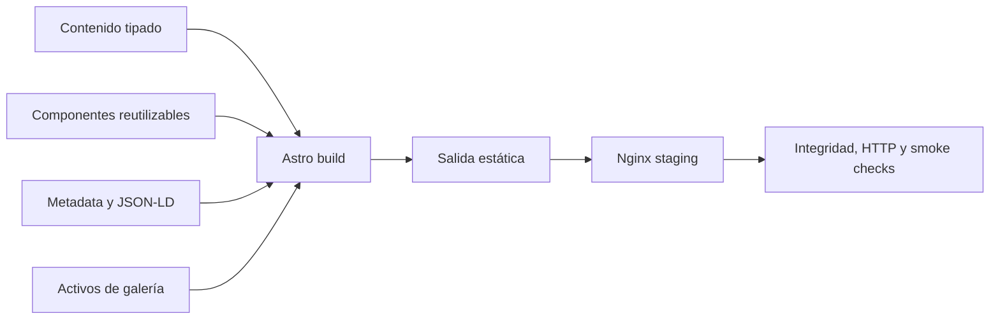

## Un sitio comercial preparado para convertir consultas en trabajos coordinados

JM Soluciones Eléctricas es una landing para obras, ampliaciones, refacciones e instalaciones eléctricas en Gran Mendoza. El producto organiza la propuesta comercial, explica el proceso de trabajo y conduce al visitante hacia una consulta por WhatsApp con contexto suficiente para iniciar un relevamiento.

El proyecto no intenta convertir un servicio local en una plataforma innecesariamente compleja. La solución usa una arquitectura estática, contenido tipado y controles de entrega reproducibles para conseguir claridad comercial, bajo costo operativo y una base mantenible.

## El problema

Un potencial cliente que necesita una instalación o reparación eléctrica suele llegar con información incompleta:

- No sabe cómo describir técnicamente el trabajo.
- Necesita distinguir entre una urgencia, una reparación y una obra planificada.
- Desconoce el alcance, la cobertura y el proceso previo al presupuesto.
- Busca evidencia visual y señales de confianza.
- Quiere resolver la consulta desde el teléfono sin completar formularios extensos.

Para el negocio, responder consultas sin zona, tipo de trabajo ni evidencia inicial genera intercambio repetitivo y dificulta clasificar oportunidades.

## Usuarios y contexto

El recorrido principal está pensado para personas que llegan desde:

- Búsqueda local.
- Recomendaciones.
- Redes sociales.
- Un enlace compartido directamente.

La interacción esperada es principalmente móvil. El sitio debe permitir comprender servicios, cobertura y condiciones básicas antes de abrir WhatsApp con un mensaje estructurado.

## La solución

El producto implementa:

- Landing responsive y mobile-first.
- Categorías de servicios eléctricos.
- Páginas específicas para tableros, urgencias, instalaciones y obras.
- Contenido comercial centralizado y tipado.
- Generación uniforme de enlaces y mensajes de WhatsApp.
- Galería de trabajos reales organizada por tipología.
- SEO local con metadatos, canonical, JSON-LD, sitemap y robots.
- Páginas orientadas a zonas de cobertura.
- Tests unitarios con Vitest.
- Build estático de producción.
- Staging con Nginx y Docker Compose.
- Quality gate y preflight de release automatizados.

## Recorrido de conversión

El objetivo del flujo no es cerrar automáticamente una contratación. Es mejorar la calidad de la primera consulta y reducir la fricción para coordinar un relevamiento y presupuesto.

## Arquitectura

La salida estática reduce superficie operativa. No se necesita un backend propio para servir el contenido ni para capturar datos personales mediante formularios.

## Decisiones técnicas

### Arquitectura static-first

**Decisión:** utilizar Astro con generación estática.

**Beneficio:** buen rendimiento, SEO, despliegue simple y menor superficie de fallo.

**Costo:** funciones dinámicas futuras deberán incorporarse mediante servicios externos o una ampliación explícita de arquitectura.

### Contenido comercial tipado

**Decisión:** centralizar identidad, servicios, proceso, cobertura, CTA y condiciones en módulos de contenido.

**Beneficio:** evita contradicciones entre secciones y facilita modificar la propuesta sin editar componentes visuales.

**Costo:** exige mantener la disciplina de no volver a hardcodear contenido comercial dentro de la interfaz.

### WhatsApp como canal de conversión

**Decisión:** construir mensajes contextualizados según el origen del CTA y el servicio consultado.

**Beneficio:** el usuario llega al canal habitual con zona, tipo de trabajo y detalle inicial, reduciendo preguntas repetidas.

**Costo:** la conversión depende de una plataforma externa y debe verificarse en distintos dispositivos.

### SEO local por intención y cobertura

**Decisión:** combinar una landing general con páginas de servicios y zonas, canonical, JSON-LD, sitemap y robots.

**Beneficio:** cada ruta responde a una intención concreta y mantiene señales técnicas consistentes.

**Costo:** ampliar páginas sin control podría generar contenido repetitivo; por eso las rutas deben conservar valor y diferenciación reales.

### Galería con validación automática

**Decisión:** comprobar que los activos declarados existan y que el build no publique referencias rotas.

**Beneficio:** la evidencia visual deja de depender únicamente de una revisión manual.

**Costo:** las fotografías requieren mantenimiento, optimización y control de autorización antes de cada publicación.

### Preflight reproducible

**Decisión:** validar el producto en un contenedor limpio, construirlo, servirlo mediante Nginx y ejecutar smoke tests sobre la salida real.

**Beneficio:** el criterio de release incluye más que la compilación local.

**Costo:** añade tiempo de CI y mantenimiento de scripts, compensado por una entrega más predecible.

## UX y contenido

La experiencia prioriza:

- Lenguaje comprensible sin eliminar precisión técnica.
- Servicios agrupados por necesidad del cliente.
- Alcance y condiciones visibles antes del contacto.
- Proceso de relevamiento, presupuesto, ejecución y entrega.
- CTA persistente y mensajes de WhatsApp con contexto.
- Evidencia visual organizada por tipo de trabajo.
- Navegación y lectura cómodas desde móvil.

La UX se evalúa como parte del sistema comercial: claridad del contenido, calidad de la consulta generada, accesibilidad y facilidad de mantenimiento importan tanto como la apariencia.

## SEO y estructura pública

La implementación incluye:

- Títulos y descripciones configurables.
- URL canonical.
- Datos estructurados JSON-LD.
- Sitemap generado.
- Archivo robots.
- Rutas de servicios.
- Páginas de cobertura local.
- Validación de integridad del output.

No se afirman posiciones en buscadores, volumen de tráfico ni conversiones. Esos resultados requieren dominio productivo, indexación y medición temporal.

## QA y entrega

El quality gate ejecuta:

- Instalación reproducible mediante `npm ci`.
- Typecheck con Astro.
- Tests unitarios con Vitest.
- Build de producción.
- Validación de integridad de `dist`.
- Comprobación de activos de galería.
- Staging con Nginx.
- Smoke tests HTTP sobre inicio, robots y sitemap.
- Registro de evidencia de preflight.
- CI mediante GitHub Actions.

El repositorio también ofrece comandos de Make y Docker Compose para alinear desarrollo, staging y validación.

## Estado real

| Capacidad | Estado | Evidencia resumida |
|---|---|---|
| Landing responsive | Implementado | Layouts y componentes Astro |
| Servicios y rutas específicas | Implementado | Contenido y páginas por intención |
| Contenido centralizado | Implementado | Módulos tipados de landing |
| Conversión por WhatsApp | Implementado | Generador y orígenes tipados |
| Galería de trabajos | Implementado | Activos organizados y validación |
| SEO técnico y local | Implementado | Metadata, JSON-LD, sitemap y robots |
| Tests unitarios | Implementado | Vitest sobre utilidades críticas |
| Build y staging | Implementado | Docker Compose y Nginx |
| Preflight de release | Implementado | Scripts de integridad y smoke HTTP |
| Quality gate en CI | Implementado | Workflow de GitHub Actions |
| Dominio productivo | Pendiente | Falta confirmar URL final |
| Referencia comercial definitiva | Pendiente | Debe configurarse antes del release |
| Métricas de conversión | Pendiente | Requiere operación pública y analítica |
| Auditoría final de accesibilidad | Pendiente | Falta evidencia dedicada |
| Core Web Vitals productivos | Pendiente | Requiere dominio desplegado |

## Trade-offs

### Lo que aporta

- Arquitectura proporcional a un sitio comercial.
- Bajo costo de runtime.
- Contenido y CTA mantenibles.
- Evidencia visual integrada al producto.
- SEO local ejecutable.
- Proceso de release reproducible.

### Lo que no intenta resolver

- Agenda automática de visitas.
- CRM o seguimiento de oportunidades.
- Pagos en línea.
- Presupuestos automáticos sin relevamiento.
- Métricas comerciales sin una operación pública.

Estas capacidades solo deberían agregarse cuando exista evidencia de que mejoran el proceso real.

## Mi aporte

Mi trabajo abarca:

- Definición del objetivo comercial y del recorrido principal.
- Organización de servicios y arquitectura de contenido.
- Diseño UX mobile-first y jerarquía de CTA.
- Implementación frontend con Astro, TypeScript y Tailwind CSS.
- Modelado de mensajes y orígenes de WhatsApp.
- SEO técnico y datos estructurados.
- Tests, Docker, staging y automatización de release.
- Documentación operativa y hoja de ruta.

## Próximos pasos

1. Confirmar dominio, referencia comercial y variables productivas.
2. Ejecutar el preflight estricto con configuración final.
3. Verificar autorización y optimización de las imágenes publicadas.
4. Completar auditoría de accesibilidad y navegación por teclado.
5. Capturar evidencia desktop y mobile reproducible.
6. Publicar y medir rendimiento, consultas y rutas de entrada.
