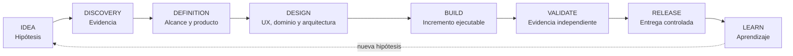
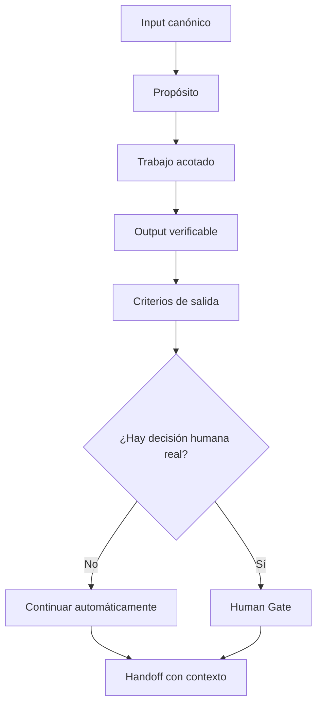
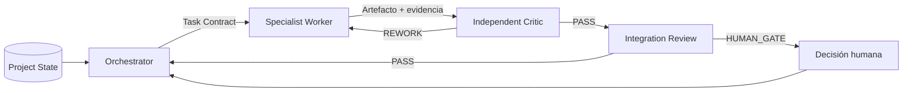
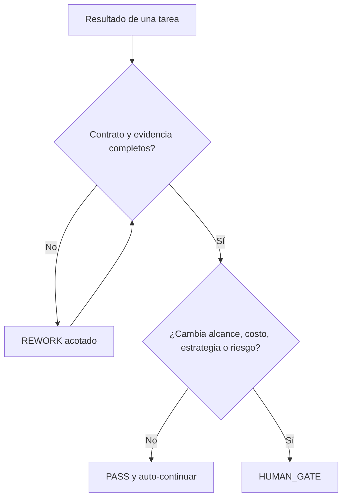

# Project Method

## Presentación pública

La práctica se presenta como un **laboratorio de producción de software**. No es una software factory ni una consultora de agentes: es un espacio personal para convertir problemas reales en software operativo, documentar decisiones y mejorar el proceso a partir de evidencia.

El método público se llama **Project Method: método de construcción verificable**.

### Promesa

Construir software con una secuencia comprensible, resultados verificables y decisiones trazables, manteniendo la arquitectura y la automatización proporcionales al problema.

### Qué demuestra

- El trabajo comienza por el problema, el contexto y la evidencia.
- Cada fase produce un artefacto o resultado que puede revisarse.
- UX, QA, seguridad y operación participan durante todo el ciclo.
- El alcance se controla explícitamente y los riesgos residuales no se esconden.
- La automatización acelera el trabajo rutinario, pero conserva decisiones humanas para estrategia, riesgo, alcance y release.
- Los agentes son una implementación posible del proceso; no son la propuesta de valor principal.

## Ciclo

`IDEA → DISCOVERY → DEFINITION → DESIGN → BUILD → VALIDATE → RELEASE → LEARN`

Cada fase responde a seis preguntas: cuál es su propósito, qué recibe, qué trabajo realiza, qué produce, cuál es su criterio de salida y qué decisión humana —si alguna— puede detener el avance.

## Contrato de fase

El método no define una cantidad fija de documentos. Define un contrato estable para que cada fase sea ejecutable y revisable.

### IDEA

Convierte una intuición en una hipótesis comprensible sin diseñar prematuramente la solución.

### DISCOVERY

Contrasta las hipótesis con usuarios, procesos, alternativas, restricciones y evidencia a favor y en contra.

### DEFINITION

Fija la propuesta de valor, las capacidades necesarias, los límites iniciales, los riesgos y lo que queda fuera.

### DESIGN

Diseña journeys, estados, dominio, arquitectura proporcional, criterios de aceptación y estrategia de pruebas.

### BUILD

Transforma el diseño en incrementos trazables, con pruebas proporcionales al riesgo, CI y documentación actualizada.

### VALIDATE

Comprueba de manera independiente la implementación contra el contrato, la evidencia y los riesgos principales. El resultado debe ser PASS, REWORK o HUMAN GATE.

### RELEASE

Prepara una entrega controlada, observable y reversible, con un registro explícito del alcance y las limitaciones conocidas.

### LEARN

Compara el resultado real con las hipótesis iniciales y convierte lo aprendido en decisiones de evolución.

## Orquestación y multiagente

La experiencia de los pilotos mostró que el cuello de botella principal no era sumar especialistas, sino preservar contexto, controlar límites, secuenciar trabajo y revisar resultados.

Por eso la arquitectura de ejecución se mantiene mínima:

1. **Orchestrator / Project Controller:** conserva fase, estado, alcance, contratos, dependencias y gates.
2. **Specialist Worker:** ejecuta una tarea acotada con inputs canónicos y un output esperado.
3. **Independent Critic / Verifier:** revisa el resultado contra el contrato y emite PASS, REWORK o HUMAN GATE.
4. **Integration Review:** comprueba que los resultados encajen entre sí y con el producto completo.

Esta capa no reemplaza el método ni el criterio humano. Sirve para que el método pueda continuar con autonomía cuando los inputs y los criterios de salida son claros, y detenerse sólo ante una decisión real, un riesgo material o un bloqueo.

## Tipos de decisión

La continuidad automática no significa ausencia de control. El sistema distingue trabajo rutinario, rework técnico y decisiones que necesitan juicio humano.

## Evidencia y límites

El método se está validando mediante proyectos reales como HMS Elite, GasFlow, Taco Loco Foodtrack y Alquileres Uspallata. Algunas partes ya demostraron valor —contratos de tarea, revisión independiente, preflight del repositorio, rework acotado y controles de integración— y otras siguen evolucionando.

No se presenta como una metodología cerrada ni como una garantía automática de éxito. Se presenta como una práctica verificable que aprende de sus fallos y que evita confundir un PASS técnico aislado con un producto completo, comprensible y listo para producción.

## Cómo se verá en el portfolio

La portada mostrará el laboratorio y sus principios en lenguaje breve. Cada caso de estudio mostrará el problema, el dominio, las decisiones, la evidencia disponible, el estado real y los límites del proyecto. La documentación del repositorio conservará el detalle operativo y la trazabilidad que no corresponde cargar en la primera lectura pública.
